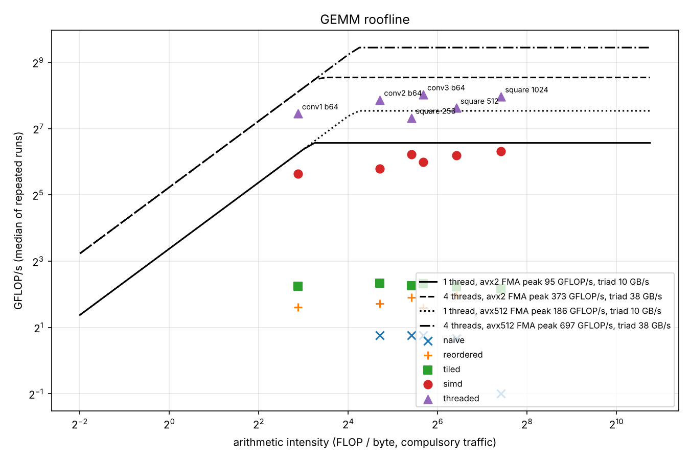

# M3: fast matrix multiply

Five implementations of `C[M][N] = A[M][K] * B[K][N]` behind one signature,
written in the order below and each measured on the same shapes. The
convolution GEMMs are TinyCNN's three layers at batch 64 (M = batch x output
pixels, N = output channels, K = 3 x 3 x input channels); the square shapes are
the usual view.

## Setup

| | |
|---|---|
| CPU | Intel Xeon @ 2.10 GHz, 4 vCPUs (cloud VM, Sapphire Rapids class: AVX2, AVX-512, VNNI), L1d 48 KiB, L2 2 MiB per core |
| Compiler | GCC 13.3.0, `-O2 -march=native -fopenmp` (Clang 18.1.3 for the comparison table) |
| Method | median of 7 timed runs after 1 warm-up; each kind is checked against the naive result on every shape before it is timed, and `bench_gemm` exits on any mismatch |
| Correctness | `test_gemm` compares every kind with a double-precision reference on 12 awkward sizes (M, N, K not multiples of any tile) and checks the threaded kind is bit-identical to the single-threaded one; `test_parity` runs the whole network with every kind |
| Raw data | `results/gemm.csv`, `results/gemm_clang.csv`, `results/sweep.csv`, `results/peak.csv`, `results/bandwidth.csv`, `results/infer.csv` |

A cloud VM is a noisy place to benchmark: medians of the same cell drift by a
few percent between runs. Differences under 5% in the tables below are noise.

## The ladder (GCC, GFLOP/s)

| shape | M x N x K | naive | reordered | tiled | simd | threaded (4) | naive to threaded |
|---|---|---:|---:|---:|---:|---:|---:|
| conv1 b64 | 65536 x 32 x 27 | 4.76 | 3.04 | 4.75 | 49.79 | 175.11 | 37x |
| conv2 b64 | 16384 x 64 x 288 | 1.70 | 3.31 | 5.03 | 55.71 | 233.24 | 137x |
| conv3 b64 | 4096 x 128 x 576 | 1.70 | 3.03 | 4.99 | 63.95 | 261.15 | 154x |
| square 256 | 256 x 256 x 256 | 1.70 | 3.77 | 4.79 | 75.00 | 160.01 | 94x |
| square 512 | 512 x 512 x 512 | 1.59 | 3.95 | 4.68 | 72.80 | 197.25 | 124x |
| square 1024 | 1024 x 1024 x 1024 | 0.50 | 4.15 | 4.49 | 79.39 | 250.25 | 500x |

### 1. Naive (`gemm_naive.cpp`)

`for i, for j, for k: C[i][j] += A[i][k] * B[k][j]`. The inner loop walks a
column of B, so consecutive k touch addresses N floats apart: a new cache line
per multiply, and for 1024 x 1024 (4 MiB per matrix) the column walk evicts
itself before the next j reuses it. 0.5 GFLOP/s there. On conv1 it is the
fastest scalar version (4.76): K is only 27, the 27 lines of one column walk
stay in L1 across all j, and the accumulator lives in a register.

### 2. Loop reordering (`gemm_reordered.cpp`)

Same arithmetic, i-k-j order: the inner loop streams a row of B into a row of
C. Every fetched cache line is used fully and the hardware prefetcher sees a
sequential pattern. 8x faster than naive on the 1024 square, and slower than
naive on conv1 (3.04 vs 4.76): the inner iteration is now load b, load c,
store c, one FMA, so it is bound by the store port at about one update per
cycle, and with K = 27 the naive version never had a cache problem to fix.

GCC at `-O2` does not vectorise this loop (its "very cheap" cost model needs
a trip count it can prove), so this step shows the memory-pattern fix alone.
Clang at `-O2` does vectorise it, and the same source runs at 16 to 23
GFLOP/s there (table further down). That is the first lesson of the ladder:
the loop order decides what the compiler is allowed to do, and what it
actually does is compiler-specific. The next step removes the dependence.

### 3. Cache tiling (`gemm_tiled.cpp`)

The reordered loops inside three blocking loops: B is cut into kc x nc
blocks, each block is run against mc rows of A before moving on, so a block is
loaded once and reused mc times instead of being re-streamed for every row.
With GCC this bought 10% to 50% over reordered, and the tile sweep below shows
why not more: the plateau is flat because the inner loop is store-bound, not
miss-bound. Blocking removes misses; it cannot speed up the arithmetic that
was already the bottleneck. Tiling pays off once the inner loop is fast
enough to be starved, which is what the next step builds.

How the tile sizes were picked: a 5 x 4 x 5 sweep of mc, kc, nc (100
configurations, median of 3 each) on the 1024 square and on conv2:

| | 1024 square | conv2 b64 |
|---|---:|---:|
| configurations | 100 | 100 |
| min / median / max GFLOP/s | 3.64 / 5.08 / 5.77 | 4.67 / 5.41 / 5.84 |
| best | mc=16 kc=128 nc=1024 | mc=64 kc=256 nc=64 |
| chosen default (64, 256, 256) | 5.06 | 5.62 |

The two "best" cells are different configurations within noise of each
other and of the chosen default, so the default was set from the cache
argument rather than the sweep: kc x nc x 4 bytes = 256 KiB of B fits in the
2 MiB L2 with room for the mc = 64 rows of A sweeping past it, and kc = 256
keeps the inner loop long enough to amortise the loop overhead. The only
clearly bad region is kc = 512 with small nc on the square (3.6 to 4.6): the
block is tall and narrow, and the mc rows of A (each 2 KiB per kc = 512) start
competing with B for L1. Full tables are in `results/sweep.csv`.

### 4. SIMD micro-kernel (`gemm_kernel.h`, `gemm_simd.cpp`)

The step that matters. The structure is the classic Goto/BLIS one:

- B is packed into strips of NR columns so the kernel reads it as one
  contiguous stream, and A into strips of MR rows, both zero-padded so the
  kernel never sees an edge.
- The micro-kernel holds an MR x NR tile of C in vector registers and, per k,
  loads NR floats of B, broadcasts MR floats of A, and issues MR x NR / width
  FMAs. On AVX2 that is 6 x 16: 12 accumulators + 2 B registers + 1 broadcast
  = 15 of the 16 ymm registers, 12 FMAs per 2 vector loads and 6 broadcasts,
  and 12 independent chains to cover the 4-cycle FMA latency across 2 ports.
  On NEON it is 8 x 12 with `fmla` by element, so A needs no broadcast at
  all: 24 FMAs per 5 loads.
- Panel sizes: mc = 72, kc = 256, nc = 3072. The packed A panel (72 KiB)
  lives in L2; one B strip (kc x NR x 4 = 16 KiB) stays in L1 while all 12
  tiles of A sweep it.

Single-threaded this is 50 to 79 GFLOP/s with GCC and 43 to 95 with Clang,
against a measured AVX2 FMA peak of 95 to 102 GFLOP/s on one core: 83% (GCC)
and 100% (Clang) of the ceiling on the 1024 square. The conv shapes sit lower
(52% to 67%) because K is short: with K = 27 a 6 x 16 tile does 27 k-steps
and then 12 stores and 12 loads of C, so the C traffic is a large share of the
work, and the per-FLOP cost of packing is 10x what it is at K = 576.

Why SIMD is not a flat 8x over scalar: the scalar versions were store-bound,
not FMA-bound, so part of the gain is the register blocking (one store per
MR x NR x K multiplies instead of one per multiply) and part is the 8 lanes.
The two together are 10x to 18x over tiled.

### 5. Threads (`gemm_threaded.cpp`)

The simd kernel with the M dimension split across OpenMP threads, dynamic
schedule, one 72-row block at a time. B is packed once per (jc, pc) block and
shared read-only; each thread packs its own A block into thread-local
scratch. M is the right axis for this engine: the conv GEMMs have M in the
thousands and N at most 128.

3.2x to 4.2x on the conv shapes and the 1024 square with 4 threads (175 to
261 GFLOP/s), 2.1x on the 256 square where a parallel region is only 4 blocks
of 65 MFLOP each and fork/join is visible. Bit-identical to the
single-threaded result, which the test checks.

## Roofline

Ceilings, all measured on this machine (`bench_peak`, `bench_bandwidth`):

| | 1 thread | 4 threads |
|---|---:|---:|
| FMA peak, AVX2 (the ISA the kernel is written in) | 95.0 GFLOP/s | 373.5 GFLOP/s |
| FMA peak, AVX-512 (what the chip has) | 185.7 GFLOP/s | 697.4 GFLOP/s |
| FMA peak, scalar | 10.5 GFLOP/s | 38.4 GFLOP/s |
| Bandwidth, copy / triad (3 x 512 MiB) | 8.6 / 10.4 GB/s | 31.9 / 37.6 GB/s |
| Ridge point (AVX2 peak / triad) | 9.1 FLOP/B | 9.9 FLOP/B |

The peak loop reveals the clock: 95 GFLOP/s = 2 FMA ports x 8 lanes x 2 FLOP
x 3.0 GHz, so this "2.10 GHz" part turbos to about 3.0 GHz on one core and
about 2.9 GHz on four.

Where each shape lands (arithmetic intensity counts each matrix touching
memory once, 2MNK / 4(MK + KN + MN) FLOP per byte):

| shape | FLOP/B | best kernel | GFLOP/s | % of AVX2 roofline | % of chip roofline |
|---|---:|---|---:|---:|---:|
| conv1 b64 | 7.3 | threaded | 175.1 | 64% | 64% |
| conv2 b64 | 26.1 | threaded | 233.2 | 62% | 33% |
| conv3 b64 | 51.1 | threaded | 261.2 | 70% | 37% |
| square 256 | 42.7 | threaded | 160.0 | 43% | 23% |
| square 512 | 85.3 | threaded | 197.3 | 53% | 28% |
| square 1024 | 170.7 | threaded | 250.3 | 67% | 36% |
| square 1024 | 170.7 | simd (1 thread) | 79.4 | 84% | 43% |

What the roofline says:

- Every shape except conv1 sits to the right of the ridge: compute-bound. The
  kernel's remaining gap to the AVX2 ceiling (30% to 40% on 4 threads, 16% on
  1 thread) is packing traffic, C tile loads and stores on short K, edge
  tiles, and the loads and broadcasts sharing issue slots with the FMAs.
- conv1 (7.3 FLOP/B) is left of the 4-thread ridge (9.9): on four cores it
  is memory-bound. Its ceiling there is 37.6 GB/s x 7.3 = 274 GFLOP/s, not
  373, and it reaches 64% of that. K = 27 means each byte of the im2col
  matrix is used 27 times and then gone.
- On this machine the chip roofline is twice the AVX2 one, so the kernel is
  at 33% to 43% of what the hardware could do. An AVX-512 micro-kernel (for
  example 14 x 32, with 28 of the 32 zmm registers as accumulators) is the
  obvious next step here. It is not written because it would not run on the
  Apple Silicon machine the project is aimed at, where NEON is the only
  width there is.

## End-to-end inference

`bench_infer`, TinyCNN forward pass including preprocessing, im2col, bias,
ReLU and pooling, milliseconds per image, median of up to 10 runs:

| batch | naive | reordered | tiled | simd | threaded | naive to threaded |
|---:|---:|---:|---:|---:|---:|---:|
| 1 | 11.708 | 7.876 | 3.984 | 0.519 | 0.503 | 23x |
| 16 | 11.838 | 8.020 | 3.852 | 0.466 | 0.280 | 42x |
| 64 | 11.927 | 7.946 | 4.087 | 0.502 | 0.283 | 42x |

At batch 1 the threads buy nothing: conv3 has M = 64 rows, less than one
72-row block, and conv2 has 256, so only conv1 (1024 rows, 15 blocks) runs in
parallel while the fixed costs are a larger share. From batch 16 up the
threaded kind holds about 3,550 images per second.

These are the M3 numbers. The M4 work on the passes around the GEMM
(`results/int8.md`) took the same FP32 engine to 0.142 ms per image at batch
64 (7,000 images per second, 82x over naive), and the per-stage breakdown of
where that time goes is there.

## Same source, other compiler (Clang 18, no OpenMP, GFLOP/s)

| shape | naive | reordered | tiled | simd |
|---|---:|---:|---:|---:|
| conv1 b64 | 5.25 | 16.68 | 16.56 | 42.88 |
| conv2 b64 | 1.72 | 22.24 | 20.85 | 64.52 |
| conv3 b64 | 1.62 | 20.71 | 20.21 | 65.37 |
| square 256 | 1.61 | 22.84 | 22.05 | 65.36 |
| square 512 | 1.54 | 23.44 | 22.56 | 78.72 |
| square 1024 | 0.63 | 18.11 | 22.82 | 95.40 |

Clang auto-vectorises the reordered and tiled inner loops, so those two
steps are 5x faster than with GCC, and tiling now shows its purpose: on the
1024 square, where B no longer fits in L2, blocking takes the vectorised loop
from 18.1 to 22.8. The explicit micro-kernel is the only step whose speed
does not depend on which compiler built it, and Clang's build of it reaches
the AVX2 ceiling on the 1024 square.

## What did not work

- **The peak benchmark, twice.** The first FMA loop used 16 accumulators
  with AVX2, which has 16 vector registers; with the two constants it
  spilled and measured 37 GFLOP/s, below the GEMM kernel it was meant to
  bound. The second used 12 but left the accumulators in an array that GCC
  at `-O2` did not unroll, so they lived on the stack: 33 GFLOP/s. Only with
  the chain loop force-unrolled did it read 95. GCC also auto-vectorised the
  "scalar" loop with AVX-512 until told not to. A peak benchmark is a program
  too, and its own bottlenecks have to be found before it says anything about
  the chip.
- **Loop reordering made conv1 slower** (4.76 to 3.04 GFLOP/s). With K = 27
  the naive column walk already fit in L1 and kept its accumulator in a
  register; the reordered loop traded that for a store per multiply.
- **Tiling barely moved with GCC.** A 100-point sweep varied by less than
  the run-to-run noise on conv2. The inner loop was store-bound, so there
  were no misses left to remove. Picking a tile size by sweep only makes
  sense once the kernel is fast enough to be limited by misses.
- **Threads at batch 1.** Zero gain: the per-layer M is too small to split.
  Any latency-oriented design would have to parallelise within a GEMM along
  N or K, or across layers, which is not worth it for this model.
